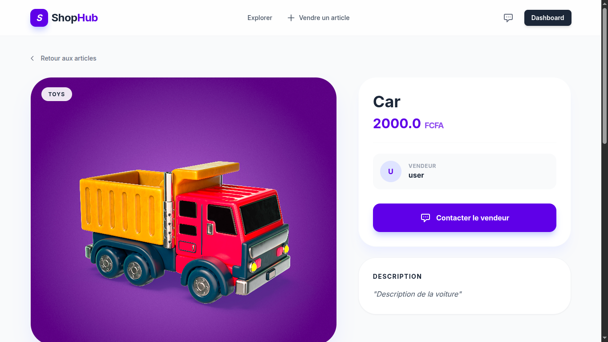
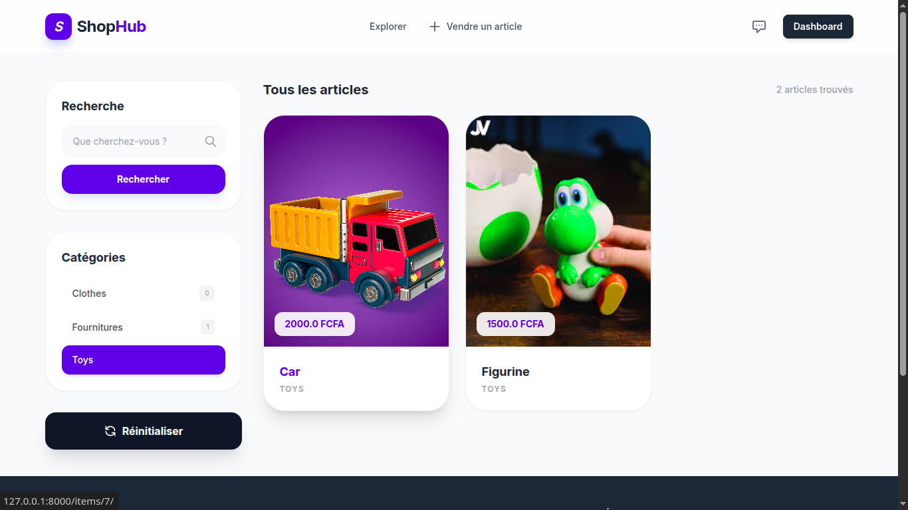
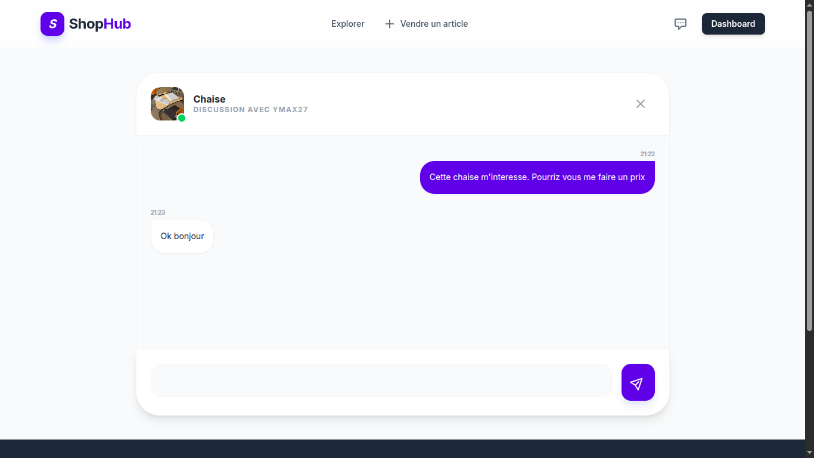

# 🛒 ShopHub - Marketplace Moderne

**ShopHub** est une plateforme de petites annonces élégante et performante conçue avec **Django** et **Tailwind CSS**. Elle permet aux utilisateurs de publier des articles, de gérer leur inventaire et de communiquer en temps réel via une messagerie intégrée.

---


## 📋 Fonctionnalités

*   **Gestion des Articles** : Création, modification et suppression d'annonces avec images.
*   **Système de Messagerie** : Discussion instantanée entre acheteurs et vendeurs.
*   **Recherche Avancée** : Filtrage par catégorie et recherche textuelle fluide.
*   **Dashboard Utilisateur** : Vue d'ensemble des articles mis en vente.
*   **Design Premium** : Interface responsive avec une esthétique moderne et épurée (Style SaaS).

## 🛠️ Stack Technique

*   **Backend** : Python 3.10+, Django 4.2+
*   **Frontend** : Tailwind CSS (via CDN ou PostCSS)
*   **Base de données** : SQLite (Développement) / PostgreSQL (Production)
*   **Traitement d'images** : Pillow

---

## 🚀 Installation

### Prérequis

- [Python](https://www.python.org/) (v3.10 ou supérieur)

### 1. Configuration

```bash
# Cloner le dépôt (si ce n'est pas déjà fait)
git clone https://github.com/Ymax27/ShopHub---MarketPlace.git
cd ShopHub---MarketPlace

# Créer et activer l'environnement virtuel
python -m venv env

# Sur Linux / macOS :
source env/bin/activate

# Sur Windows :
# .\env\Scripts\activate

# Installer les dépendances
pip install -r requirements.txt

#Lancer le serveur
python3 manage.py runserver

```

## 📸 Captures d'écran








## 🗂️ Structure du projet

```
└── docs/
    └── sreenshots/    
        ├── gestion.png
        │             

├── config/            #Projet et config
├── conversation/      #Application conversation
├── core/              #Application principale
├── dashboard/         #Application dashboard
├── item/              #Application item
├── manage.py             
├── requirements.txt   # Dépendances Python
│
├── README.md
├── .gitignore
└── LICENSE
```


## 📦 Dépendances

Voir le fichier `requirements.txt` pour la liste complète des dépendances.

## 🤝 Contribution

Les contributions sont les bienvenues ! N'hésitez pas à :

1. Fork le projet
2. Créer une branche pour votre fonctionnalité (`git checkout -b feature/AmazingFeature`)
3. Commit vos changements (`git commit -m 'Add some AmazingFeature'`)
4. Push vers la branche (`git push origin feature/AmazingFeature`)
5. Ouvrir une Pull Request


## 👤 Auteur

**Votre Nom**

- GitHub: [@Ymax27](https://github.com/Ymax27)
- Email: lindsellmaxwell@gmail.com

## 🙏 Remerciements

- Merci à la communauté Python et Django
- Inspiration : \

## 📞 Support

Pour toute question ou problème, veuillez ouvrir une [issue](https://github.com/Ymax27/ShopHub---MarketPlace.git).

---

⭐ Si ce projet vous a été utile, n'hésitez pas à lui donner une étoile !